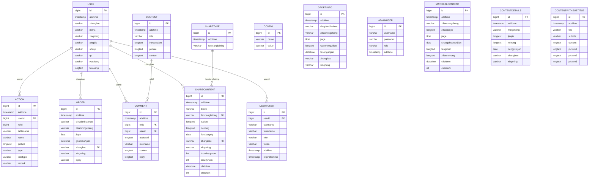

```mermaid
erDiagram
    USER {
        bigint id PK
        timestamp addtime
        varchar zhanghao
        varchar mima
        varchar xingming
        varchar xingbie
        varchar shouji
        varchar qq
        varchar youxiang
        longtext touxiang
    }

    ACTION {
        bigint id PK
        timestamp addtime
        bigint userid FK
        bigint refid
        varchar tablename
        varchar name
        longtext picture
        varchar type
        varchar inteltype
        varchar remark
    }

    CONTENT {
        bigint id PK
        timestamp addtime
        varchar title
        longtext introduction
        longtext picture
        longtext content
    }

    ORDER {
        bigint id PK
        timestamp addtime
        varchar dingdanbianhao
        varchar ziliaomingcheng
        float jiage
        datetime goumaishijian
        varchar zhanghao FK
        varchar xingming
        varchar ispay
    }

    SHARETYPE {
        bigint id PK
        timestamp addtime
        varchar fenxiangleixing
    }

    COMMENT {
        bigint id PK
        timestamp addtime
        bigint refid FK
        bigint userid FK
        longtext avatarurl
        varchar nickname
        longtext content
        longtext reply
    }

    CONFIG {
        bigint id PK
        varchar name
        varchar value
    }

    ORDERINFO {
        bigint id PK
        timestamp addtime
        varchar dingdanbianhao
        varchar ziliaomingcheng
        float jiage
        longtext wanzhengziliao
        datetime fasongshijian
        varchar zhanghao
        varchar xingming
    }

    SHARECONTENT {
        bigint id PK
        timestamp addtime
        varchar biaoti
        varchar fenxiangleixing FK
        longtext tupian
        longtext neirong
        date fenxiangriqi
        varchar zhanghao FK
        varchar xingming
        int thumbsupnum
        int crazilynum
        datetime clicktime
        int clicknum
    }

    ADMINUSER {
        bigint id PK
        varchar username
        varchar password
        varchar role
        timestamp addtime
    }

    MATERIALCONTENT {
        bigint id PK
        timestamp addtime
        varchar ziliaomingcheng
        longtext ziliaojianjie
        float jiage
        date shangchuanshijian
        longtext fengmian
        longtext ziliaoneirong
        datetime clicktime
        int clicknum
    }

    CONTENTDETAILS {
        bigint id PK
        timestamp addtime
        varchar mingcheng
        longtext jianjie
        longtext neirong
        date dengjishijian
        varchar zhanghao
        varchar xingming
    }

    USERTOKEN {
        bigint id PK
        bigint userid FK
        varchar username
        varchar tablename
        varchar role
        varchar token
        timestamp addtime
        timestamp expiratedtime
    }

    CONTENTWITHSUBTITLE {
        bigint id PK
        timestamp addtime
        varchar title
        varchar subtitle
        longtext content
        longtext picture1
        longtext picture2
        longtext picture3
    }

    USER ||--o{ ACTION: "userid"
    USER ||--o{ ORDER: "zhanghao"
    USER ||--o{ COMMENT: "userid"
    USER ||--o{ SHARECONTENT: "zhanghao"
    USER ||--o{ USERTOKEN: "userid"
    CONTENT ||--o{ COMMENT: "refid"
    SHARETYPE ||--o{ SHARECONTENT: "fenxiangleixing"
```