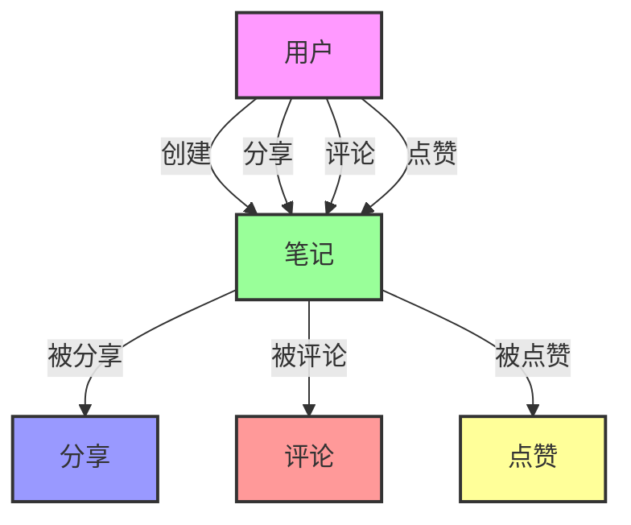

```mermaid
graph TD
    %% 实体定义
    User[用户] -->|创建| Note[笔记]
    User -->|分享| Note
    User -->|评论| Note
    User -->|点赞| Note
    Note -->|被分享| Share[分享]
    Note -->|被评论| Comment[评论]
    Note -->|被点赞| Like[点赞]

    %% 样式调整
    style User fill:#f9f,stroke:#333,stroke-width:2px
    style Note fill:#9f9,stroke:#333,stroke-width:2px
    style Share fill:#99f,stroke:#333,stroke-width:2px
    style Comment fill:#f99,stroke:#333,stroke-width:2px
    style Like fill:#ff9,stroke:#333,stroke-width:2px

```