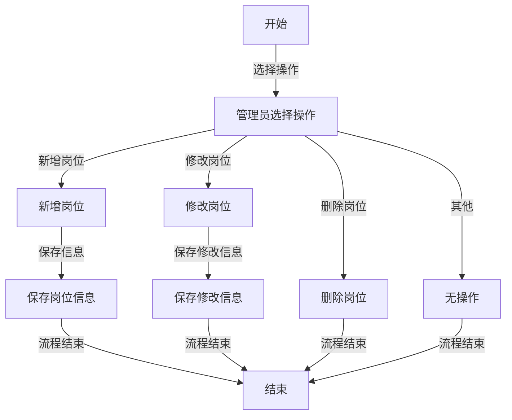

```mermaid
graph TD
    A[开始] -->|选择操作| B[管理员选择操作]
    B -->|新增岗位| C[新增岗位]
    C -->|保存信息| D[保存岗位信息]
    B -->|修改岗位| E[修改岗位]
    E -->|保存修改信息| F[保存修改信息]
    B -->|删除岗位| G[删除岗位]
    B -->|其他| H[无操作]
    D -->|流程结束| I[结束]
    F -->|流程结束| I
    G -->|流程结束| I
    H -->|流程结束| I
  
```